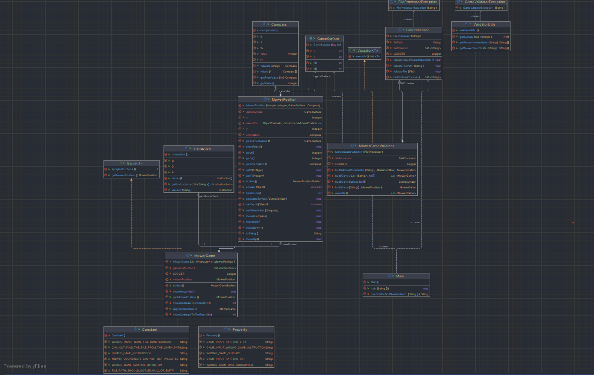

# La tondeuse (MOWER)

## Authors

- [Junior Yao ](https://github.com/junioryao/MowerGame/tree/master)

***
***

# SUMMARY

1. [Setup](##)
2. [Algorithm Explanation](##)
3. [Program UML](##)

***
***

## Setup

### Requirement

* JDK 11
* Maven

***
***

### Game execution

#### **there are 2 ways to execute this programme**

***
***

#### 1.1 ) execute via command line

After performing a maven clean install you will find a Jar file in ./target, then
perform the following command to execute the jar following by your input file path

```
EXAMPLE => java -jar jarFile.jar gamefile.txt

java -jar .\target\tondeuse-1.0-SNAPSHOT.jar .\gameInputPattern.text
```

**Remark**

* If no text input is passed in, therefor a default one will be used
* The game support only one argument as the above example

***

#### 1.2 ) run via an IDE

* open the project in a desire IDE (intelliJ)
* you can replace the game input pattern by changing the path variable inside
  **overrideDefaultGamePattern()** by your own in order to execute your pattern
* run the main class

***
***

## Algorithm Explanation

### Mower orientation Controller

* the idea is to move either left or right at 90° which mean in a space we are moving we are moving in a clockwise or
  anti clockwise direct

* In clockWise direction : N E S W

* In anti clockWise direction : N W S E

* 

let consider the compass coordinate in this order **[N , E , S , W]**

the implementation of the algorithm works similarly by keeping the index of the actual orientation controlled by
instruction . If instruction is equal to G and index is at S at position (2) the new position will be E at position (1)
, the idea is to decrement the value of the index,besides when it is D the value is incremented and the algorithm keep
circling around the same array

For edges when is less than 0, at position 0 for N for instance => the new position is equal to arraySize - 1 in our
case it moves to index 3 .

On the other hand when index is greater than 3 , at position 3 for W , the index is reset to 0

In this way the algorithm circle around the orientation space

***

### Mower movement in space

let's consider a grid space as the image below
we can just notice that to move Up or Down
x is the same (constant in space) while Y is either incremented or decremented .
With the same concept to move horizontally (left <-> right)
Y is constant in space and x is either incremented or decremented.


## Program UML




